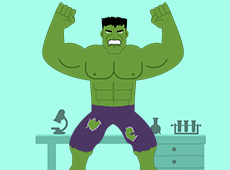

<link rel="stylesheet" type="text/css" href="css/lightbox.min.css">

Hier finden Sie eine Auswahl meiner Arbeiten. Einige Projekte wurden während meines CAWEB-Masterjahres oder während meiner Ausbildung im Rathaus von Forbach realisiert, andere sind persönliche Experimente.

    

    

    

 
    
    
    

