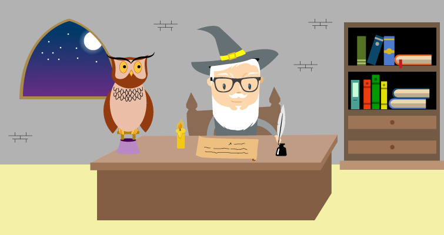

    

    
Vous souhaitez me contacter ? 
Cliquez sur le bouton c’est plus rapide que par pigeon voyageur !

<form>
    <label for="fname">Votre nom</label>
    <input type="text" id="name" name="name" placeholder="Votre nom...">

<label for="name">Votre email</label>
<input type="email" id="email" name="email" placeholder="Votre email...">
    
<label for="message">Votre message</label>
<input type="text" id="message" name="message" placeholder="Votre message...">
    
  

    
Envoyer

</form>

 

