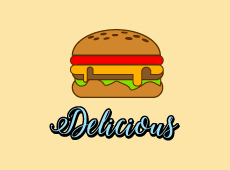
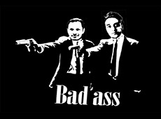
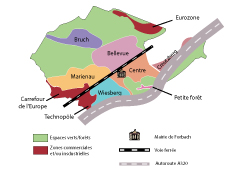
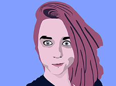
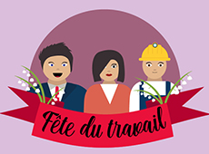

<link rel="stylesheet" type="text/css" href="css/lightbox.min.css">

Retrouvez ici une sélection de mon travail. Certains projets ont été réalisé durant mon année en master CAWEB ou durant mon apprentissage à la Ville de Forbach, d’autres sont des expérimentations personnelles.

    

    

    

 
    
    
    

