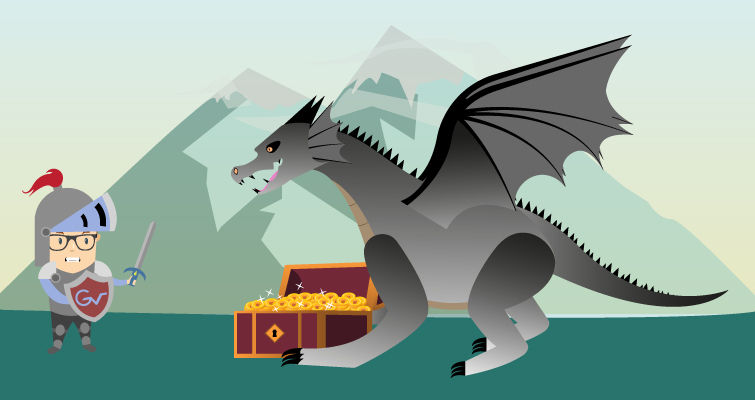

    
    
<h2 class="text_center">La passion des langues étrangères</h2>
    

    

Il n’y a pas si longtemps que ça, j’étais un jeune bachelier tout droit sorti d’une filière scientifique avec des facilités en langues. J’avais donc décidé de suivre une formation en langues étrangères appliquées dans la contrée de Strasbourg. J’ai pu étudier de manière très avancée la beauté et la complexité des langues avec lesquelles je me suis passionné au cours d’échanges culturels et professionnels.

En effet, je peux aisément communiquer en allemand ou en anglais que ce soit à l’oral ou à l’écrit. Je suis également capable de traduire un texte en plusieurs langues. Mon stage de dernière année en licence au sein de l’entreprise allemande <a href="https://www.acsueppmayer.de/" target="_blank">AC Süppmayer GmbH</a> m’a notamment permis de prouver que j’étais capable de communiquer et travailler au sein d’une équipe essentiellement composée d’employés allemands. Cette formation m’a également permis de suivre l’option HTML, ce fût mon premier contact avec le monde du web.
 
    

<h2 class="text_center">Graphiste web et print en herbe</h2>
    
    

    

J’ai poursuivi ma voie en suivant un master en linguistique informatique et traduction. Cependant je me suis vite rendu compte que j’avais une préférence pour la création graphique plutôt que la programmation. En effet, j’ai développé une véritable passion pour les montages photos que je réalise avec Adobe Photoshop.

Par la suite, la participation à la réalisation d’un catalogue suisse-allemand en plaçant correctement divers éléments visuels et textuels m’a permis de développer mes capacités en graphisme print lors de mon travail en intérim chez <a href="https://www.boutique-sdag.net/" target="_blank">« SDAG »</a>, un distributeur d'accessoires pour la communication visuelle. Cette pratique du métier de graphiste print a révélé mon envie de faire de ce domaine mon métier.

Par conséquent, j’ai rejoint le <a href="https://mastercaweb.u-strasbg.fr/" target="_blank">master 2 CAWEB</a> en alternance avec un poste en tant qu’apprenti webmaster à la <a href="http://www.mairie-forbach.fr/" target="_blank">mairie de Forbach</a>. J’ai pu mettre en pratique l’ensemble de mes connaissances acquises dans le multimédia en procédant à la refonte du site internet de cette collectivité.

    

    
  

  

<a href="docs/CV%20Vincent%20GOLOMBEK.pdf" target="_blank" class="button_page">Voir mon CV</a>  

    